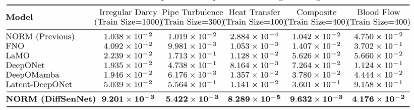
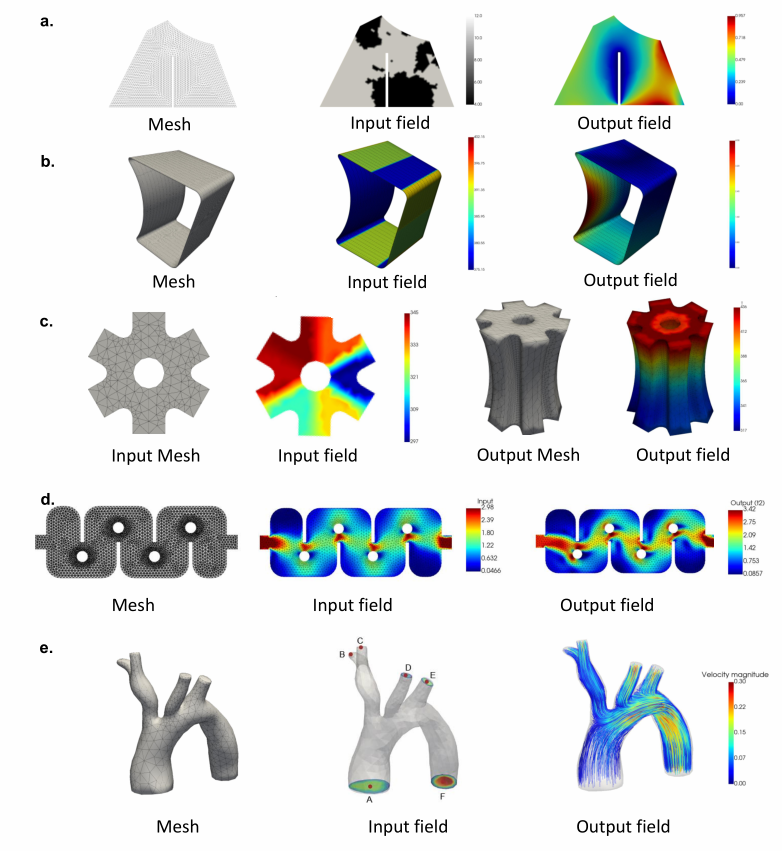
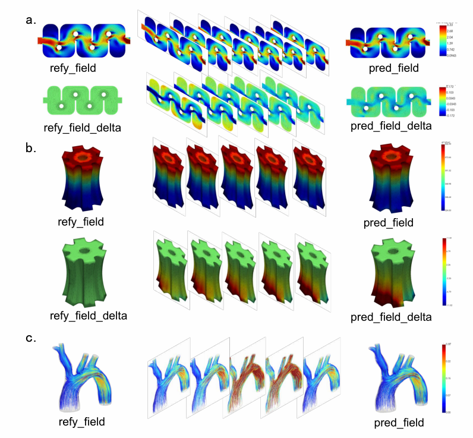

# ApplianceODE：基于参数化 ODE 的神经算子场预测

**从相似的已知物理场出发，学习输入变化引起的输出变化，在不规则网格上预测目标物理场。**

本项目围绕偏微分方程（PDE）的数据驱动求解，结合 **NORM 不规则域神经算子、DeltaPhi 参考差分学习，以及 ODE 形式的隐空间更新**，开展 Darcy 流、管道湍流、热传导、复合材料和血流五类任务的实验。研究材料将敏感度建模方向称为 **DiffSenNet**；本仓库保留了基线、差分版本和多种 ODE 实验版本。

## 1. 这个项目解决什么问题？

假设我们想知道：改变材料参数后，温度会如何分布？改变输入条件后，流体速度会如何变化？

传统数值方法需要根据网格和方程重新计算。神经算子则利用已有仿真数据，学习“输入场 → 输出场”的映射，作为物理仿真的代理模型。

本项目进一步利用一个直观想法：**如果已经知道一个相似问题的答案，就先从这个答案出发，再预测需要修改多少。**

例如，已知某种输入条件下的温度分布，面对相近的新条件，模型可以预测温度分布的变化量，再加回原来的温度场。

这相当于把任务拆成三步：

1. 在训练数据中找一个相似的参考样本。
2. 根据目标输入和参考输入的差异，学习输出如何调整。
3. 将预测的调整量加到参考输出上，得到目标输出。

## 2. 方法与创新思路

### 2.1 NORM：在不规则网格上学习物理场

图像通常是整齐的像素网格，但血管、管道和复杂零件的网格往往不规则。

代码中的 `Approximation_block` 使用拉普拉斯–贝尔特拉米算子（LBO）的特征基，将节点上的场压缩为一组谱系数，在谱空间进行可学习变换，再还原到网格节点。

可以把这些基函数理解为一组适应几何形状的“基本空间模式”：模型学习不同模式如何组合，从而表示整个物理场。

主要过程为：

```python
# 示意：省略批次、通道维度调整
coeff = LBO_INVERSE @ field       # 节点场 → 谱系数
coeff = learned_transform(coeff) # 学习模式之间的映射
output = LBO_MATRIX @ coeff      # 谱系数 → 节点场
```

NORM 是项目使用的基础方法。项目的改进重点在于参考差分建模和 ODE 形式的更新，而非将 LBO 或 NORM 本身作为原创贡献。

### 2.2 DeltaPhi：预测相对参考样本的变化量

模型同时接收目标输入、参考输入、参考输出和相似度信息，以参考输出作为预测的起点：

$$
\hat u(a)=u(a_{ref})+\Delta u_{net}(a,a_{ref},u(a_{ref}),s).
$$

其中：

| 符号 | 含义 |
| --- | --- |
| `a` | 目标输入场 |
| `a_ref` | 相似的参考输入场 |
| `u(a_ref)` | 参考样本已知的输出场 |
| `s` | 目标输入与参考输入的相似度 |
| `Δu_net` | 网络预测的输出修正量 |

例如，Darcy 任务的 `NORM_Net_DeltaPhi.forward()` 最终执行：

```python
return x + ref_y.reshape(x.shape)
```

这里 `x` 是网络输出的修正量，`ref_y` 是参考物理场。通过这种结构，模型将学习重点放在样本之间的变化上。

### 2.3 ODE 形式更新：将变化拆成多个小步骤

ODE 版本在隐空间中逐步更新表示，而不是直接一次输出全部修正量。

以 Darcy 的 `NORM_Net_ODE2` 为例：先编码参考输出，再编码目标输入与参考输入，利用输入差异构建可学习的更新尺度，最后进行多个 RK4 形式的更新步骤。

```python
depth_coord = (x_coord - ref_x) / float(self.steps)
depth_scale = self.coord_proj(depth_coord)

# 示意：省略张量维度调整
for _ in range(self.steps):
    k1 = self.func(a, h)
    k2 = self.func(a + 0.5 * depth_scale, h + 0.5 * depth_scale * k1)
    k3 = self.func(a + 0.5 * depth_scale, h + 0.5 * depth_scale * k2)
    k4 = self.func(a + depth_scale, h + depth_scale * k3)
    h = h + depth_scale / 6.0 * (k1 + 2*k2 + 2*k3 + k4)
```

`func()` 是由谱变换、逐点卷积和激活函数组成的网络，负责预测隐状态的变化方向。RK4 形式通过四次变化方向估计来更新隐状态。

通俗地说：**参考答案提供起点，输入差异告诉模型调整的尺度，神经网络决定每一步如何调整。**

这里的更新发生在学习到的隐空间，更新尺度也经过了可学习投影。因此，应将其理解为受参数路径积分启发的网络结构；它不等同于直接调用物理方程求解器，也不能仅凭结构认定网络输出就是严格的物理敏感度。

### 2.4 敏感度视角与研究拓展

研究材料提出用敏感度场描述“参数改变时，系统状态如何改变”：

$$
S(t,x;\theta)=\frac{\partial u(t,x;\theta)}{\partial\theta}.
$$

对于光滑的状态映射，沿参数路径积分敏感度，可以由参考状态重建目标状态：

$$
u(\theta)-u(\theta_{ref})
=\int_0^1 S(\theta_{ref}+\tau\Delta\theta)\,\Delta\theta\,d\tau.
$$

这一视角为差分预测和逐步更新提供了动机，也可用于进一步研究参数影响分析、外推和控制设计。当前代码主要展示场预测、参考检索和隐空间更新；物理敏感度的准确性、因果机制发现和控制效果仍需专门实验验证。

## 3. 代码结构与阅读顺序

各任务单独维护模型和实验脚本，便于适配不同输入输出网格及数据格式。

| 路径 | 主要用途 |
| --- | --- |
| `Case1_DarcyFlow/` | 不规则域 Darcy 流实验 |
| `PipeTurbulence/` | 管道湍流实验 |
| `HeatTransfer/` | 热传导实验，含序列误差统计脚本 |
| `Composites/` | 复合材料任务实验 |
| `BloodFlow/` | 血流任务实验 |
| 各任务的 `model.py` | NORM 基础网络、参考差分及 ODE 版本 |
| 各任务的 `rag_utils.py` | 相似样本检索、参考样本构建及数据加载 |
| 各任务的 `utils.py` | 数据标准化、相对 L2 损失、参数量统计等 |
| `figures/` | 实验对比表与可视化图片 |
| `DeltaPhi_ODE.docx`、`article` | 研究材料 |

### 建议先看 Darcy 任务

| 文件 / 类 | 看什么 |
| --- | --- |
| `main.py`、`NORM_Net` | 基线的数据处理与直接预测 |
| `rag_utils.py` | 如何根据输入相似度找到参考样本 |
| `main_deltaphi.py`、`NORM_Net_DeltaPhi` | 如何利用参考输出预测残差 |
| `main_ode.py`、`NORM_Net_ODE2` | 如何构建隐状态并进行 RK4 形式更新 |

其他任务中，`norm.py` / `main.py` 通常用于基线，`norm_DeltaPhi.py` / `main_DeltaPhi.py` 用于差分实验，`norm_ode.py` / `main_ode.py` 及 `ode_theta*.py` 等保留 ODE 相关实验。具体模型以各入口脚本实际导入的类为准。

### `rag_utils.py`：参考检索怎样工作？

这里的 RAG 是对数值输入场检索参考样本：

1. 将每个输入场展平为向量。
2. 使用余弦相似度比较目标输入与训练输入。
3. 训练时排除样本自身，并从候选参考中随机选取一个。
4. 测试时从训练集中检索最相似的参考样本。
5. 返回 `x`、`ref_x`、`ref_y`、`ref_score`。

参考输出来自训练集；测试输出用于误差评估。推理依赖一个包含已知输入输出对的参考库，因此复现与部署时都需要保留该参考库。

### 训练与评估流程

以 Darcy 的 `main_ode.py` 为例：读取 `.mat` 数据 → 构建网格并计算 LBO 基 → 按训练集统计量标准化 → 构建参考检索数据加载器 → 初始化模型 → 用 Adam 和学习率调度器训练 → 解码回原始物理量 → 计算相对 L2 误差 → 保存日志和预测结果。

该脚本计算 MSE 用于记录，但实际反向传播调用的是相对 L2 损失。部分实验会保存 `log.csv`、`NORM_loss.mat`、`NORM_pre.mat`；文件位置由对应脚本中的日志路径决定。

## 4. 实验成果

### 4.1 五类任务上的预测精度

以下结果来自仓库 `figures/Table2.png` 和研究材料，指标为**相对 L2 误差，越低越好**。这些是项目已有实验结果，本 README 整理过程未重新训练模型。

$$
\mathrm{Relative\ L2}=\frac{\|\hat u-u\|_2}{\|u\|_2}.
$$

| 方法 | Darcy 流 | 管道湍流 | 热传导 | 复合材料 | 血流 |
| --- | ---: | ---: | ---: | ---: | ---: |
| 训练样本数 | 1000 | 300 | 100 | 400 | 400 |
| NORM | 1.038e-2 | 1.019e-2 | 2.884e-4 | 1.042e-2 | 4.750e-2 |
| FNO | 4.092e-2 | 9.981e-3 | 1.053e-3 | 1.407e-2 | 3.702e-1 |
| LaMO | 2.239e-2 | 1.713e-1 | 1.128e-3 | 5.626e-2 | 5.660e-1 |
| DeepONet | 1.935e-2 | 4.738e-1 | 8.164e-3 | 7.264e-2 | 1.124e-1 |
| DeepOMamba | 1.946e-2 | 6.176e-3 | 1.357e-3 | 3.780e-2 | 4.444e-2 |
| Latent-DeepONet | 5.039e-2 | 5.564e-1 | 1.141e-3 | 3.601e-2 | 9.158e-1 |
| **NORM（DiffSenNet）** | **9.201e-3** | **5.422e-3** | **8.289e-5** | **9.632e-3** | **4.176e-2** |

相较 NORM 基线，五类任务的误差均有所下降：

| 任务 | 相对误差下降 |
| --- | ---: |
| Darcy 流 | 11.36% |
| 管道湍流 | 46.79% |
| 热传导 | 71.26% |
| 复合材料 | 7.56% |
| 血流 | 12.08% |

下降比例按 `(基线误差 − 改进误差) / 基线误差 × 100%` 计算。其中，热传导误差从 `2.884e-4` 降至 `8.289e-5`，是这五组对比中相对改善最明显的任务。



> 数据口径说明：`Table1.png` 中 FNO 的 Darcy 基线写作 `4.095`，而 `Table2.png` 写作 `4.092e-2`，两者存在冲突。本节采用 Table2 的完整对比表，未采用 Table1 中该项 99.72% 的增益。各结果表尚需与原始日志、具体脚本版本和随机种子逐项对应。

### 4.2 外推实验与可视化

研究材料将 `Table3.png` 至 `Table8.png` 对应为外推测试及 p1–p5 设置，展示模型在训练参数范围外的误差对比。由于当前材料未完整给出各参数范围和数据划分，外推结果应结合具体设置解读。





这些图展示了不同几何结构上的输入输出，以及预测场与参考场、变化量之间的关系。场图适合直观观察空间分布，最终精度判断仍应以误差指标为依据。

### 4.3 已形成的项目成果

- 在五类物理任务中保留了 NORM、参考差分和 ODE 相关实验代码。
- 实现了数值场参考检索、残差预测和多步隐状态更新。
- 形成了训练日志、预测场导出和误差对比的实验流程。
- 已有结果表显示，相较 NORM 基线，五类任务相对 L2 误差下降约 **7.56%–71.26%**。

当前结果表主要支持预测精度结论。训练脚本虽可记录耗时和参数量，但材料没有提供统一硬件、统一测量口径的推理耗时对比，因此暂不宣称具体加速倍数。

## 5. 如何运行

### 5.1 环境准备

代码使用 Python 和 PyTorch。以下列出从源码导入项整理的主要依赖，尚未锁定一套完整验证过的版本组合：

```bash
pip install torch numpy scipy pandas scikit-learn tqdm lapy setproctitle
```

多个原始脚本直接调用 `.cuda()`，运行前需要准备可用的 PyTorch CUDA 环境。部分脚本包含设备选择逻辑，其他脚本如需在 CPU 上运行，应统一修改设备迁移代码。

### 5.2 数据准备

当前仓库未包含训练所需的 `datasets/` 数据。需要另行准备对应 `.mat` 文件，并按脚本要求提供网格或 LBO 特征基。

| 示例任务 | 数据要求 |
| --- | --- |
| Darcy 流 | `MeshNodes`、`MeshElements`、`c_field`、`u_field`；脚本根据网格计算 LBO 基 |
| 热传导 | `input`、`output`；另需输入、输出 LBO 基文件，其中包含 `Eigenvectors` |

各任务的字段和路径可能不同，请先查看入口脚本中的 `sio.loadmat()` 调用和参数配置。

### 5.3 运行示例

```bash
git clone https://github.com/ShiqiChen951/ApplianceODE.git
cd ApplianceODE/Case1_DarcyFlow

# 先修改脚本底部的 data_dir、样本数、训练轮数等配置
python main.py           # NORM 基线
python main_deltaphi.py  # 参考差分版本
python main_ode.py       # ODE 形式版本
```

请从任务子目录启动脚本，以匹配当前的局部导入和相对数据路径。Darcy 的 `main_ode.py` 默认包含 5 次重复实验、每次 1000 轮训练，首次检查流程时可先减少轮数和重复次数，并让样本数与 batch size 相匹配。

## 6. 当前边界与后续改进

本仓库主要用于研究实验，保留了多个迭代版本。完整复现还需要数据、依赖版本和结果对应关系。

- **版本与数据对齐**：将每张结果表对应到明确的脚本、配置、数据划分和模型权重，并报告多次运行的均值与标准差。
- **模块消融**：分别验证参考检索、差分结构、更新步数和积分形式对精度与耗时的影响。
- **敏感度验证**：与有限差分或可信求解器得到的敏感度比较，检查隐空间更新是否准确反映物理参数响应。
- **序列评估**：`DiffSenNet_time2.py` 中的 rollout 统计基于已预测序列，属于非自回归评估；若要验证长期递推稳定性，需要加入真正的自回归测试。
- **运行健壮性**：例如热传导 `NORM_Net_DeltaPhi_ODE2` 中，`a` 和 `depth_scale` 当前只在输入输出节点数不同时赋值，同节点数配置需要补全分支后使用。
- **拓展应用**：进一步研究参数外推、少样本适应、关键参数识别和敏感度引导优化，并提供各自独立的评价指标。

## 7. 许可证

本仓库使用 [Apache License 2.0](LICENSE)。使用或扩展 NORM、DeltaPhi 等相关方法时，请同时遵守所依赖代码及数据的许可要求，并引用相应原始工作。
